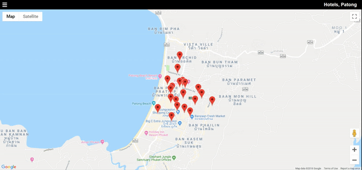

# Neighborhood Map (React)

It is a single page app uses React Google maps, foursquare API and flickr API to list some museums in NY. This project was built for Udacity's front-end web developer Nanodegree.

PROJECT SPECIFICATION:
[Neighborhood Map project rubric](https://review.udacity.com/#!/rubrics/1351/view).



### Built with:

- [Create React App](https://github.com/facebookincubator/create-react-app).
- [Google Map React Component](https://github.com/fullstackreact/google-maps-react/)
- [axios](https://github.com/axios/axios) - to make a request for data
- [dotnv](https://www.npmjs.com/package/dotenv) - to hide api keys
- [Flickr API](https://www.flickr.com/services/api/) - to get locations nearby
- [Foursquare API](https://developer.foursquare.com/) - to get photos for locations

### How to run

1. Download or clone this repository
2. Install all project dependencies with `npm install`
3. _Development Mode:_ start the development server with `npm start`. Open [http://localhost:3000](http://localhost:3000) to view it in the browser.
4. _Production Mode:_ create a production build with `npm run build`. Builds the app for production to the `build` folder.
5. You will need api keys. Create a `.env` file in the root directory of your project. Add environment-specific variables on new lines in the form of NAME=VALUE. For example:

```
   REACT_APP_FLICKR_KEY=key
   REACT_APP_FLICKR_SECRET=key
   REACT_APP_GOOGLE_API=key
   REACT_APP_CLIENT_ID=key
   REACT_APP_CLIENT_SECRET=key
```
